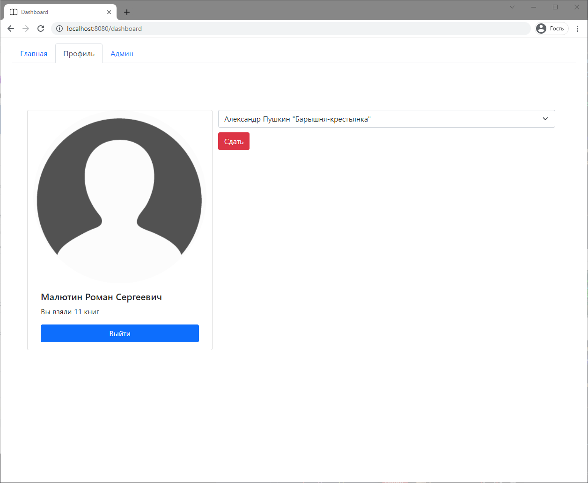

# LibrarySystem
## Установка и запуск
Чтобы установить все модули, нужно перейти в каталог с проектом и использовать команду
```sh
npm install
```

http://localhost:8080/
Для запуска и тестов сервера достаточно запустить файл  **main.js**
```sh
node main.js
```
Для запуска и работы сервера в фоне лучше установить **pm2**
```sh
npm install pm2
...
pm2 start main.js
```
Подробнее о pm2 - https://pm2.keymetrics.io/

## Страницы
###### Главная страница


###### Страница авторизация пользователя


###### Страница пользователя


###### Страница авторизация администратора


###### Страница администратора

